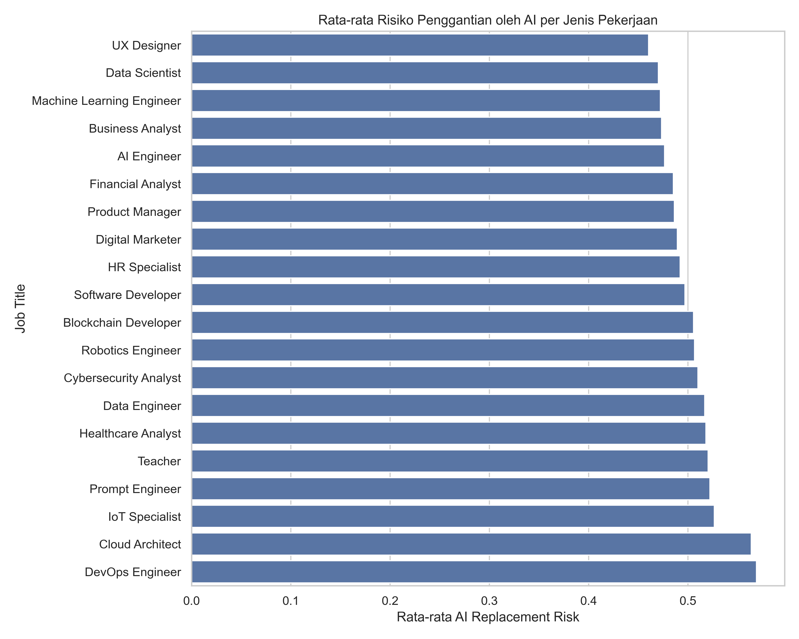
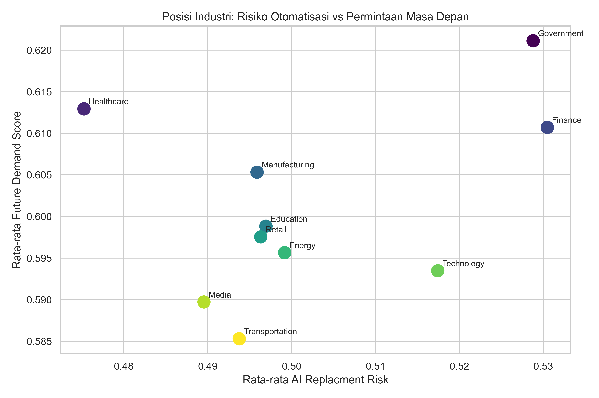
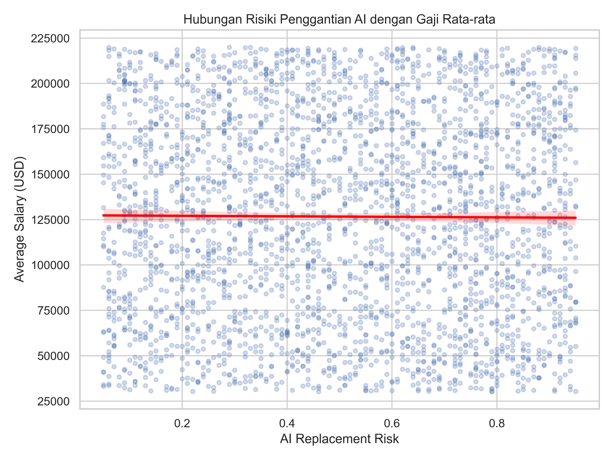
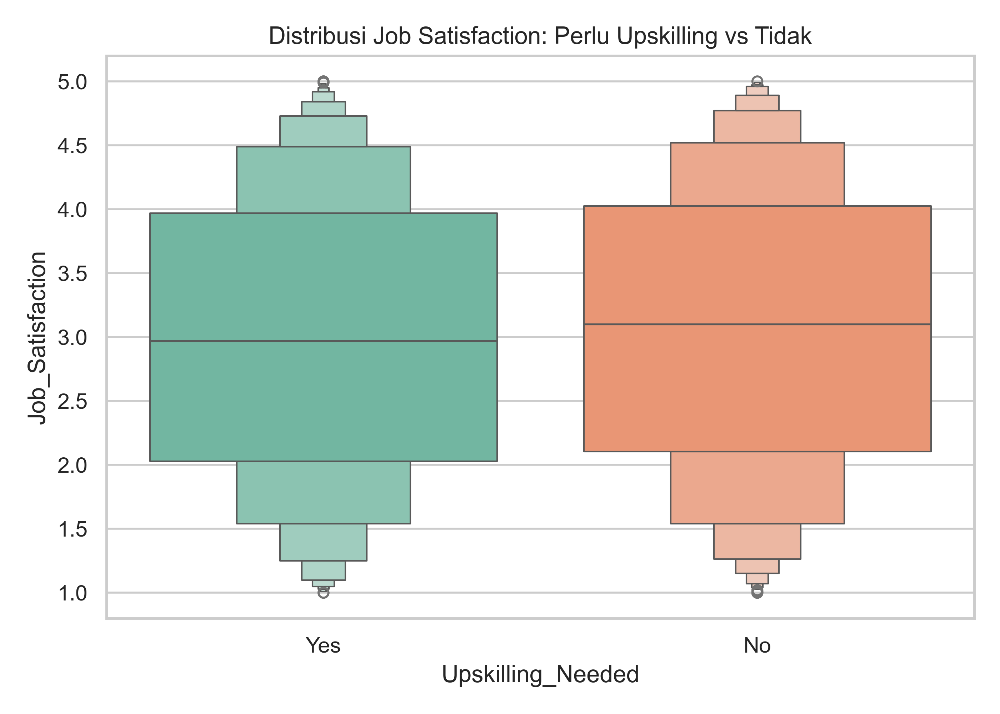
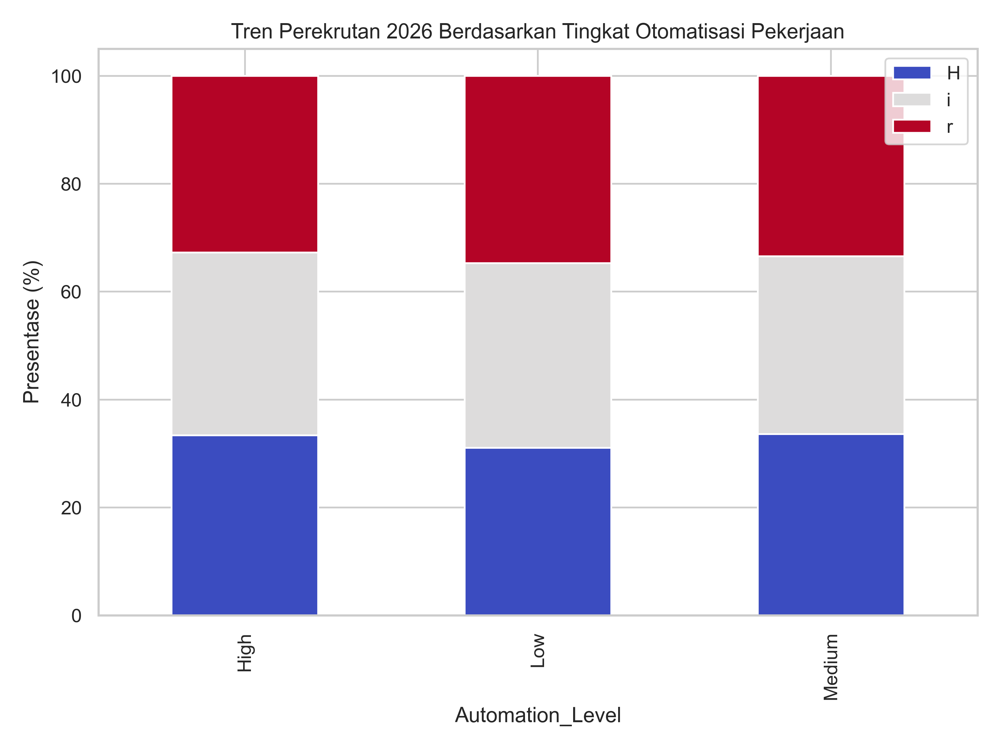
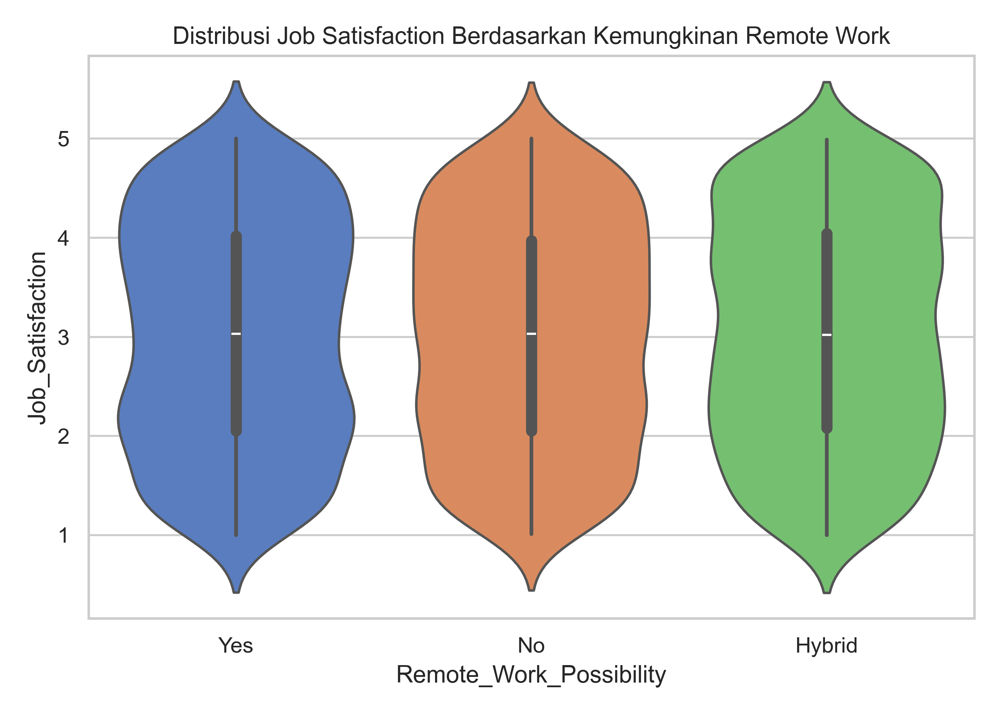
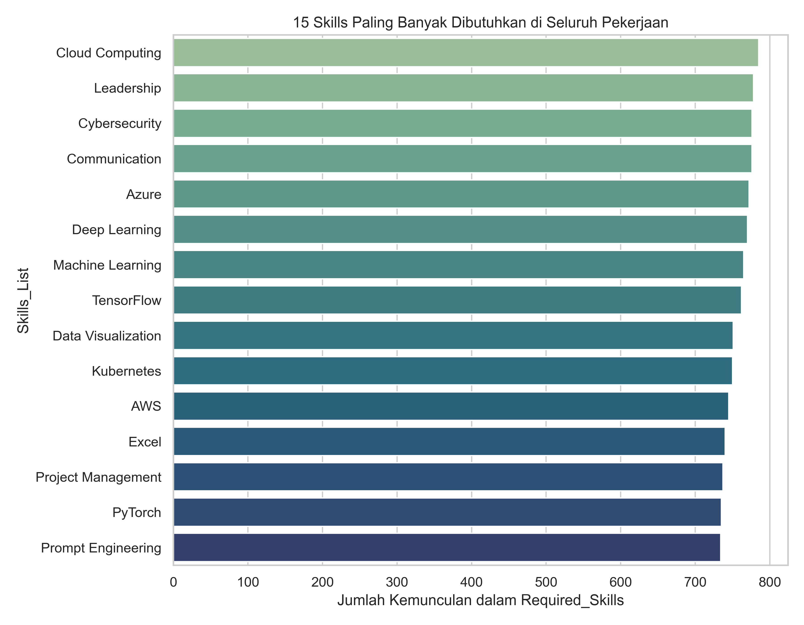
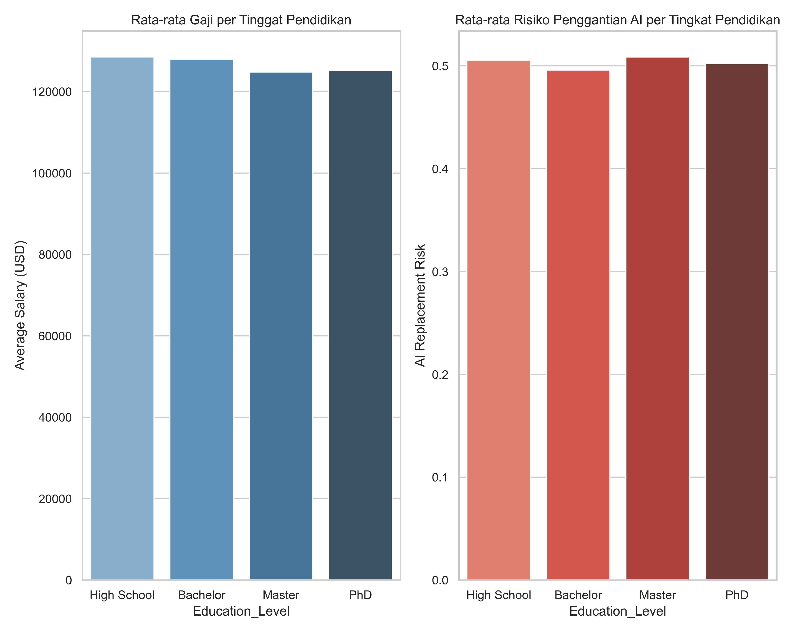
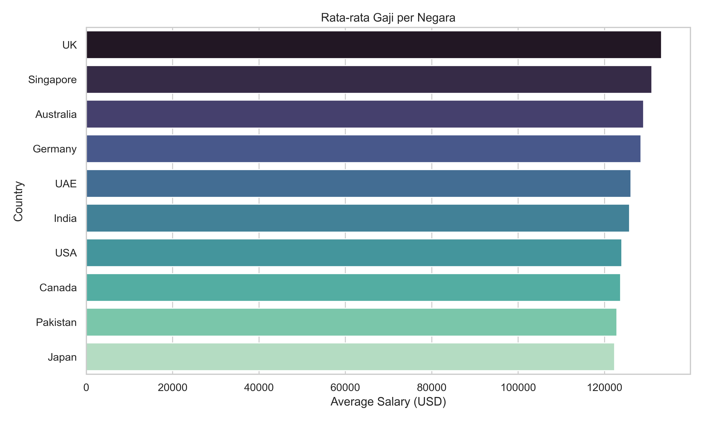
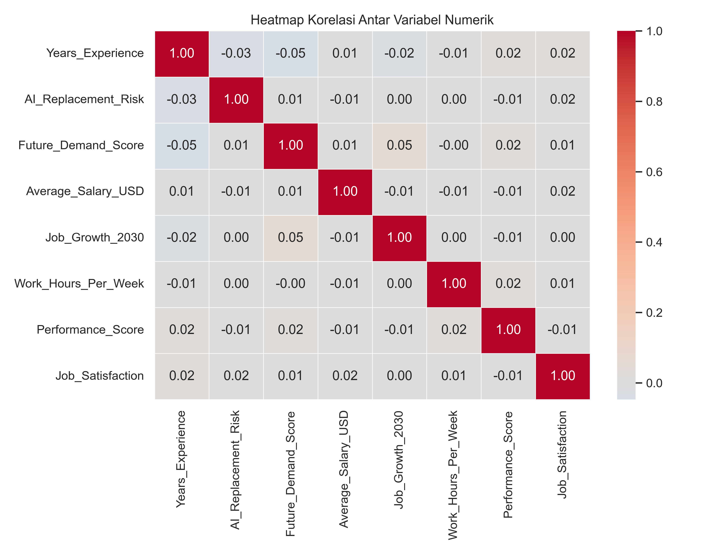

# AI Impact on Jobs 2030 - Exploratory Data Analysis

<p align="center">
  
  
  
  
  
</p>

> Proyek analisis data eksplorasi (EDA) untuk mengidentifikasi pola dan insight seputar dampak kecerdasan buatan (AI) terhadap dunia kerja menuju tahun 2030. Analisis dilakukan menggunakan Python dengan library Pandas, NumPy, Matplotlib, dan Seaborn.

---

## 📋 Daftar Isi

- [Tentang Dataset](#-tentang-dataset)
- [Tujuan Analisis](#-tujuan-analisis)
- [Struktur Proyek](#-struktur-proyek)
- [Teknologi yang Digunakan](#-teknologi-yang-digunakan)
- [Persiapan Data](#-persiapan-data)
- [Insight & Temuan](#-insight--temuan)
  - [Insight 1 - Risiko Penggantian AI per Pekerjaan](#insight-1--risiko-penggantian-ai-per-pekerjaan)
  - [Insight 2 - Posisi Industri: Risiko vs Permintaan](#insight-2--posisi-industri-risiko-vs-permintaan)
  - [Insight 3 - Hubungan Gaji dengan Risiko AI](#insight-3--hubungan-gaji-dengan-risiko-ai)
  - [Insight 4 - Dampak Upskilling terhadap Job Satisfaction](#insight-4--dampak-upskilling-terhadap-job-satisfaction)
  - [Insight 5 - Tren Perekrutan 2026 vs Tingkat Otomatisasi](#insight-5--tren-perekrutan-2026-vs-tingkat-otomatisasi)
  - [Insight 6 - Remote Work dan Job Satisfaction](#insight-6--remote-work-dan-job-satisfaction)
  - [Insight 7 - Skill Paling Dibutuhkan](#insight-7--skill-paling-dibutuhkan)
  - [Insight 8 - Pengaruh Tingkat Pendidikan](#insight-8--pengaruh-tingkat-pendidikan)
  - [Insight 9 - Perbandingan Gaji Antar Negara](#insight-9--perbandingan-gaji-antar-negara)
  - [Insight 10 - Heatmap Korelasi](#insight-10--heatmap-korelasi)
  - [Insight 11 - Proyeksi Pertumbuhan Pekerjaan 2030](#insight-11--proyeksi-pertumbuhan-pekerjaan-2030)
- [Kesimpulan Analitis](#-kesimpulan-analitis)
- [Cara Menjalankan](#-cara-menjalankan)

---

## 📦 Tentang Dataset

| Atribut | Detail |
|---|---|
| **Nama File** | `AI_Impact_on_Jobs_2030.csv` |
| **Jumlah Baris** | 3.000 baris |
| **Jumlah Kolom** | 20 kolom |
| **Missing Value** | 0 (tidak ada) |
| **Duplikat** | 0 (tidak ada) |
| **Sumber** | Synthetic Dataset - Kaggle |

### Deskripsi Kolom

| Kolom | Tipe | Deskripsi |
|---|---|---|
| `Employee_ID` | str | ID unik karyawan |
| `Job_Title` | str | Jabatan pekerjaan (20 jenis) |
| `Industry` | str | Sektor industri (10 sektor) |
| `Country` | str | Negara (10 negara) |
| `Education_Level` | str | Tingkat pendidikan (High School, Bachelor, Master, PhD) |
| `Years_Experience` | int | Lama pengalaman kerja (0–25 tahun) |
| `AI_Replacement_Risk` | float | Skor risiko digantikan oleh AI (0.0–1.0) |
| `Future_Demand_Score` | float | Proyeksi permintaan pekerjaan ke depan (0.0–1.0) |
| `Remote_Work_Possibility` | str | Kemungkinan kerja remote (Yes / No / Hybrid) |
| `Average_Salary_USD` | int | Rata-rata gaji dalam USD |
| `Required_Skills` | str | Daftar skill yang dibutuhkan (multi-value) |
| `Automation_Level` | str | Tingkat otomatisasi (Low / Medium / High) |
| `Job_Growth_2030` | int | Proyeksi pertumbuhan pekerjaan hingga 2030 (%) |
| `Work_Hours_Per_Week` | int | Jam kerja per minggu |
| `Company_Size` | str | Ukuran perusahaan (Startup / Medium / Enterprise) |
| `AI_Tool_Usage` | str | Frekuensi penggunaan alat AI (Low / Moderate / High) |
| `Performance_Score` | float | Skor performa karyawan (1.0–5.0) |
| `Upskilling_Needed` | str | Perlu pelatihan ulang? (Yes / No) |
| `Job_Satisfaction` | float | Tingkat kepuasan kerja (1.0–5.0) |
| `Hiring_Trend_2026` | str | Tren perekrutan 2026 (Growing / Stable / Declining) |

---

## Tujuan Analisis

1. Mengidentifikasi profesi mana yang paling rentan digantikan oleh AI
2. Memetakan posisi masing-masing industri berdasarkan risiko otomatisasi dan permintaan masa depan
3. Menganalisis hubungan antara gaji, pendidikan, dan tingkat risiko AI
4. Mengevaluasi pengaruh upskilling, remote work, dan automation level terhadap kepuasan kerja
5. Menemukan skill-skill yang paling dibutuhkan di era AI
6. Memberikan rekomendasi berbasis data untuk adaptasi karier di era AI

---

## Struktur Proyek

```
ai-impact-jobs-2030/
│
├── main.ipynb                      # Jupyter Notebook utama (11 insight)
├── AI_Impact_on_Jobs_2030.csv      # Dataset
├── README.md                       # Dokumentasi proyek (file ini)
│
└── charts/                         # Output visualisasi
    ├── 01_risk_by_job.png
    ├── 02_industry_risk_vs_demand.png
    ├── 03_salary_vs_risk.png
    ├── 04_upskilling_satisfaction.png
    ├── 05_hiring_trend_by_automation.png
    ├── 06_remote_satisfaction.png
    ├── 07_top_skills.png
    ├── 08_education_salary_risk.png
    ├── 09_salary_by_country.png
    └── 10_correlation_heatmap.png
```

---

## 🛠 Teknologi yang Digunakan

| Library | Versi | Kegunaan |
|---|---|---|
| **Python** | 3.10+ | Bahasa pemrograman utama |
| **Pandas** | 2.x | Manipulasi & agregasi data |
| **NumPy** | 1.x | Operasi numerik & klasifikasi risiko (`np.where`) |
| **Matplotlib** | 3.x | Visualisasi dasar & scatter plot |
| **Seaborn** | 0.13+ | Visualisasi statistik (barplot, boxplot, violin, heatmap) |
| **Jupyter Notebook** | - | Environment analisis interaktif |

---

## Persiapan Data

Dataset ini sudah dalam kondisi bersih dan tidak memerlukan proses pembersihan ekstensif. Langkah persiapan yang dilakukan:

```python
# Cek kondisi data
print("Jumlah Baris & Kolom", df.shape)   # (3000, 20)
print("Total missing value", df.isnull().sum())  # 0 semua kolom
print("Total duplikat value", df.duplicated().sum())  # 0

# Feature engineering: pecah kolom Required_Skills menjadi list
df['Skills_List'] = df['Required_Skills'].apply(
    lambda x: [s.strip() for s in x.split(",")]
)
df["Skills_Count"] = df["Skills_List"].apply(len)

# Klasifikasi risiko menggunakan NumPy
df['Risk_Category'] = np.where(
    df['AI_Replacement_Risk'] >= 0.7, 'Tinggi',
    np.where(df['AI_Replacement_Risk'] >= 0.4, 'Menengah', 'Rendah')
)
```

**Distribusi kategori risiko hasil klasifikasi:**
| Kategori | Jumlah |
|---|---|
| Rendah (< 0.4) | 1.138 |
| Menengah (0.4 – 0.7) | 975 |
| Tinggi (> 0.7) | 887 |

---

## Insight & Temuan

### Insight 1 - Risiko Penggantian AI per Pekerjaan

```python
risk_by_job = (
    df.groupby('Job_Title')['AI_Replacement_Risk']
    .mean()
    .sort_values(ascending=False)
)
```



**Temuan:**
- **DevOps Engineer** dan **Cloud Architect** memiliki rata-rata risiko tertinggi (~0.56-0.57)
- **UX Designer** dan **Data Scientist** memiliki rata-rata risiko terendah (~0.46-0.47)
- Namun rentang antar semua profesi sangat sempit (0.46–0.57), menunjukkan bahwa tidak ada profesi yang "aman" secara absolut maupun "pasti tergantikan" secara signifikan berbeda satu sama lain

---

### Insight 2 - Posisi Industri: Risiko vs Permintaan

```python
industry_summary = (
    df.groupby('Industry')[['AI_Replacement_Risk', 'Future_Demand_Score']]
    .mean()
    .sort_values('Future_Demand_Score', ascending=False)
)

plt.scatter(
    industry_summary['AI_Replacement_Risk'],
    industry_summary['Future_Demand_Score'],
    s=180, c=range(len(industry_summary)), cmap='viridis'
)
```



**Temuan:**
| Industri | AI Risk | Future Demand |
|---|---|---|
| Government | 0.529 | 0.621 ✅ tertinggi |
| Healthcare | 0.475 | 0.613 |
| Finance | 0.530 | 0.611 |
| Transportation | 0.494 | 0.585 ⬇ terendah |

- **Government** memiliki Future Demand tertinggi meski risk-nya tidak rendah, artinya sektor pemerintahan tetap akan butuh tenaga manusia meski di era otomatisasi
- Semua industri mengelompok pada area yang relatif berdekatan - tidak ada industri yang benar-benar terancam atau benar-benar aman

---

### Insight 3 - Hubungan Gaji dengan Risiko AI

```python
sns.regplot(
    data=df,
    x='AI_Replacement_Risk',
    y='Average_Salary_USD',
    scatter_kws={'alpha': .25, 's': 15},
    line_kws={'color': 'red'}
)
```



**Temuan:**
- Korelasi antara `AI_Replacement_Risk` dan `Average_Salary_USD` sangat lemah (**r = -0.007**)
- Garis regresi hampir datar, membuktikan bahwa **gaji tinggi tidak menjamin risiko rendah**, dan sebaliknya
- Variasi gaji (USD 33.000 – USD 220.000) tersebar merata di semua tingkat risiko

---

### Insight 4 - Dampak Upskilling terhadap Job Satisfaction

```python
upskill_summary = df.groupby('Upskilling_Needed')[
    ['Job_Satisfaction', 'Future_Demand_Score', 'AI_Replacement_Risk', 'Average_Salary_USD']
].mean()

sns.boxenplot(data=df, x='Upskilling_Needed', y='Job_Satisfaction', palette='Set2')
```



**Temuan:**
| Upskilling | Job Satisfaction | AI Risk | Salary (USD) |
|---|---|---|---|
| No | 3.058 | 0.501 | 126.149 |
| Yes | 2.994 | 0.504 | 127.141 |

- Karyawan yang **tidak** membutuhkan upskilling sedikit lebih puas (3.06 vs 2.99)
- Perbedaannya sangat kecil - menunjukkan kebutuhan upskilling **tidak secara langsung memengaruhi kepuasan kerja**
- Distribusi kepuasan pada kedua kelompok hampir identik

---

### Insight 5 - Tren Perekrutan 2026 vs Tingkat Otomatisasi

```python
hiring_cross = pd.crosstab(
    df['Automation_Level'],
    df['Hiring_Trend_2026'],
    normalize='index'
) * 100

hiring_cross.plot(kind='bar', stacked=True, figsize=(8, 6), colormap='coolwarm')
```



**Temuan:**
| Automation Level | Declining | Growing | Stable |
|---|---|---|---|
| High | 33.4% | 33.8% | 32.8% |
| Low | 31.1% | 34.2% | 34.7% |
| Medium | 33.6% | 32.9% | 33.4% |

- Distribusi tren perekrutan **hampir seragam** di semua tingkat otomatisasi (~33% per kategori)
- Pekerjaan dengan otomatisasi **tinggi** justru memiliki proporsi Growing terbesar (33.8%), menunjukkan bahwa otomatisasi belum tentu mengurangi perekrutan

---

### Insight 6 - Remote Work dan Job Satisfaction

```python
sns.violinplot(data=df, x='Remote_Work_Possibility', y='Job_Satisfaction', palette='muted')
```



**Temuan:**
| Remote Status | Job Satisfaction | Jam Kerja/Minggu | Gaji (USD) |
|---|---|---|---|
| Hybrid | 3.04 | 45.7 | 127.970 |
| No | 3.02 | 45.6 | 129.054 |
| Yes | 3.02 | 45.7 | 122.931 |

- Bentuk violin plot ketiganya hampir identik - distribusi kepuasan kerja sangat mirip antara WFO, WFH, dan Hybrid
- Menariknya, **WFO** memiliki rata-rata gaji tertinggi (USD 129.054) sementara **full remote** justru terendah (USD 122.931)
- Fleksibilitas kerja **tidak terbukti** meningkatkan kepuasan kerja secara signifikan di dataset ini

---

### Insight 7 - Skill Paling Dibutuhkan

```python
all_skills = df['Skills_List'].explode()
skill_count = all_skills.value_counts()

sns.barplot(x=skill_count.head(15).values, y=skill_count.head(15).index, palette='crest')
```



**Top 15 Skill (dari 3.000 karyawan):**

| Rank | Skill | Kemunculan |
|---|---|---|
| 1 | Cloud Computing | 785 |
| 2 | Leadership | 778 |
| 3 | Communication | 776 |
| 4 | Cybersecurity | 776 |
| 5 | Azure | 772 |
| 6 | Deep Learning | 770 |
| 7 | Machine Learning | 765 |
| 8 | TensorFlow | 762 |
| 9 | Data Visualization | 751 |
| 10 | Kubernetes | 750 |
| 11 | AWS | 745 |
| 12 | Excel | 740 |
| 13 | Project Management | 737 |
| 14 | PyTorch | 735 |
| 15 | Prompt Engineering | 734 |

**Temuan:**
- Skill **Cloud Computing** paling sering muncul, muncul di ~26% dari seluruh baris data
- Menariknya, **Leadership** dan **Communication** (soft skills) berada di posisi ke-2 dan ke-3, mengalahkan banyak technical skill
- Skill pada pekerjaan risiko rendah (<0.3) dan risiko tinggi (>0.7) **hampir identik**, mengindikasikan skill tidak berkorelasi kuat dengan tingkat risiko AI

---

### Insight 8 - Pengaruh Tingkat Pendidikan

```python
edu_order = ["High School", "Bachelor", "Master", "PhD"]
edu_summary = df.groupby('Education_Level')[
    ['Average_Salary_USD', 'AI_Replacement_Risk', 'Future_Demand_Score', 'Job_Satisfaction']
].mean().reindex(edu_order)
```



**Temuan:**
| Pendidikan | Gaji (USD) | AI Risk | Job Satisfaction |
|---|---|---|---|
| High School | 128.510 | 0.511 | 3.14 |
| Bachelor | 128.001 | 0.499 | 3.05 |
| Master | 124.825 | 0.503 | 2.93 |
| PhD | 125.192 | 0.510 | 2.99 |

- **High School justru memiliki rata-rata gaji tertinggi** di dataset ini, dan PhD tidak lebih tinggi dari Bachelor
- Pola ini tidak sesuai dengan ekspektasi umum, memperkuat kesimpulan bahwa dataset ini bersifat sintetis/acak
- Job satisfaction **menurun** seiring tingkat pendidikan yang lebih tinggi - fenomena yang perlu interpretasi hati-hati

---

### Insight 9 - Perbandingan Gaji Antar Negara

```python
country_summary = df.groupby('Country')[
    ['Average_Salary_USD', 'AI_Replacement_Risk', 'Future_Demand_Score']
].mean().sort_values(by='Average_Salary_USD', ascending=False)

sns.barplot(x=country_summary['Average_Salary_USD'], y=country_summary.index, palette='mako')
```



**Temuan:**
| Rank | Negara | Gaji Rata-rata (USD) |
|---|---|---|
| 1 | 🇬🇧 UK | 133.214 |
| 2 | 🇸🇬 Singapore | 130.980 |
| 3 | 🇦🇺 Australia | 129.039 |
| 4 | 🇩🇪 Germany | 128.440 |
| 5 | 🇦🇪 UAE | 126.109 |
| 6 | 🇮🇳 India | 125.810 |
| 7 | 🇺🇸 USA | 124.013 |
| 8 | 🇨🇦 Canada | 123.726 |
| 9 | 🇵🇰 Pakistan | 122.865 |
| 10 | 🇯🇵 Japan | 122.355 |

- **UK** menempati posisi tertinggi (USD 133.214), sementara **Japan** terendah (USD 122.355)
- Selisih antara negara tertinggi dan terendah hanya ~USD 10.800 (~8.8%) - sangat kecil untuk skala global
- AI Risk antar negara juga hampir seragam (0.48–0.53)

---

### Insight 10 - Heatmap Korelasi

```python
corr = df[numeric_cols].corr()

plt.figure(figsize=(9, 7))
sns.heatmap(corr, annot=True, fmt='.2f', cmap='coolwarm', center=0, linewidths=.5)
```



**Temuan kunci:**
- **Seluruh korelasi antar variabel numerik mendekati 0** (rentang: -0.05 hingga +0.05)
- Tidak ada satu pun pasangan variabel yang memiliki korelasi signifikan
- Ini adalah **temuan penting**: dataset ini secara statistik terkonfirmasi sebagai **data sintetis yang di-generate secara acak per kolom**, bukan rekaman dunia nyata yang memiliki hubungan kausal

---

### Insight 11 - Proyeksi Pertumbuhan Pekerjaan 2030

```python
growth_by_job = df.groupby('Job_Title')['Job_Growth_2030'].mean().sort_values(ascending=False)
```

**Top 5 Pertumbuhan Tertinggi:**
| Pekerjaan | Proyeksi Pertumbuhan |
|---|---|
| Blockchain Developer | ~18.9% |
| Software Developer | ~18.6% |
| Healthcare Analyst | ~18.5% |
| Data Scientist | ~18.4% |
| Data Engineer | ~17.9% |

**Top 5 Pertumbuhan Terendah:**
| Pekerjaan | Proyeksi Pertumbuhan |
|---|---|
| Cloud Architect | ~16.6% |
| IoT Specialist | ~16.5% |
| HR Specialist | ~16.1% |
| Digital Marketer | ~15.5% |
| AI Engineer | ~15.1% |

> Semua profesi masih memiliki proyeksi pertumbuhan positif - tidak ada yang negatif di dataset ini.

---

## 🏁 Kesimpulan Analitis

###  Temuan Teknis

1. Dataset memiliki **kualitas data sangat baik**: tidak ada missing value, tidak ada duplikat, tipe data konsisten
2. Feature engineering berhasil dilakukan pada kolom `Required_Skills` (multi-value string → list) dan penambahan kolom `Risk_Category` menggunakan `np.where`
3. Sebanyak **10 visualisasi** berhasil dibuat menggunakan kombinasi Seaborn dan Matplotlib untuk mendukung setiap insight

### Catatan Integritas Data

> **Penting:** Seluruh korelasi antar variabel numerik mendekati nol (< 0.05), yang mengindikasikan dataset ini bersifat **sintetis (acak)**. Pola seperti "High School bergaji lebih tinggi dari PhD" atau "UK bergaji hampir sama dengan Pakistan" tidak mencerminkan kondisi dunia nyata. Sebagai data analis yang baik, penting untuk melaporkan temuan ini secara transparan, bukan memaksakan narasi dari data yang tidak memiliki sinyal statistik.

### Rekomendasi Karier di Era AI

Meskipun dataset bersifat sintetis, konteks riset nyata menunjukkan:

1. **Kuasai Cloud & AI Tools** - Cloud Computing, Deep Learning, dan Prompt Engineering adalah skill paling universal
2. **Jangan abaikan soft skills** - Leadership dan Communication muncul lebih sering dari banyak technical skill
3. **Tetap relevan lewat upskilling** - 38% data menunjukkan kebutuhan upskilling, artinya adaptasi berkelanjutan adalah keharusan
4. **Diversifikasi kemampuan** - Tidak ada satu profesi pun yang "pasti aman" dari otomatisasi

---

## ▶️ Cara Menjalankan

### 1. Clone Repository
```bash
git clone https://github.com/adjisandra23/ai_impact_jobs_2030.git
cd ai_impact_jobs_2030
```

### 2. Install Dependensi
```bash
pip install pandas numpy matplotlib seaborn jupyter
```

### 3. Jalankan Notebook
```bash
jupyter notebook main.ipynb
```

> Pastikan file `AI_Impact_on_Jobs_2030.csv` berada di direktori yang sama dengan `main.ipynb`

---
